# 🎬 Filmka

**Filmka** — это современное веб-приложение. Добавляй фильмы в коллекции, оценивай. Построено на React + Firebase + TMDB API.

---

## 📸 Скриншоты

### Главная страница

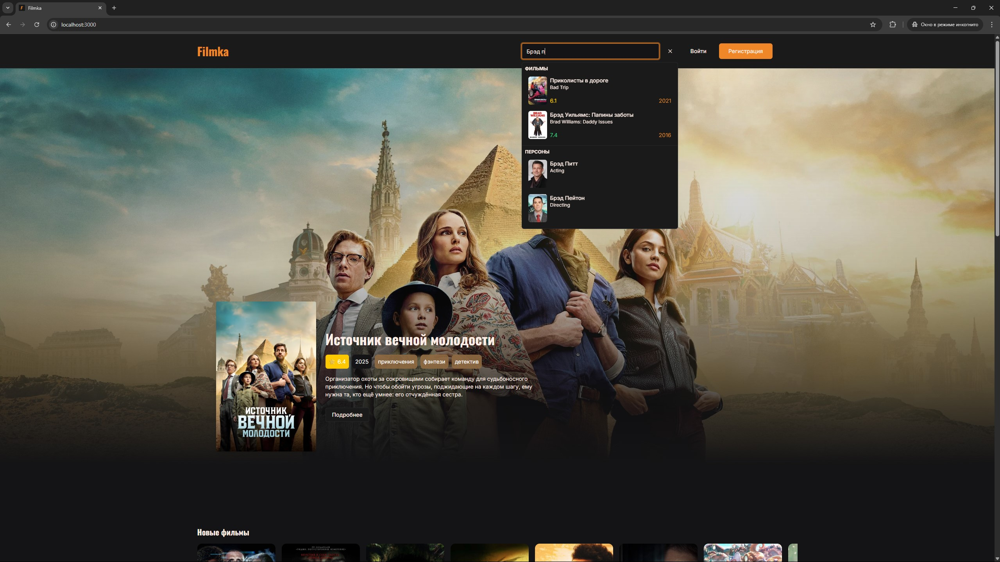
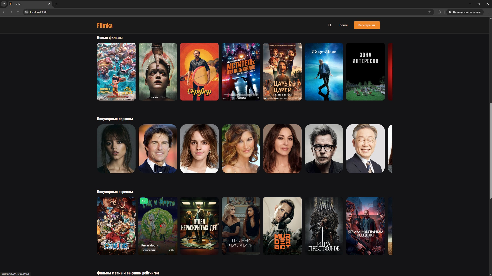

### Страница фильма

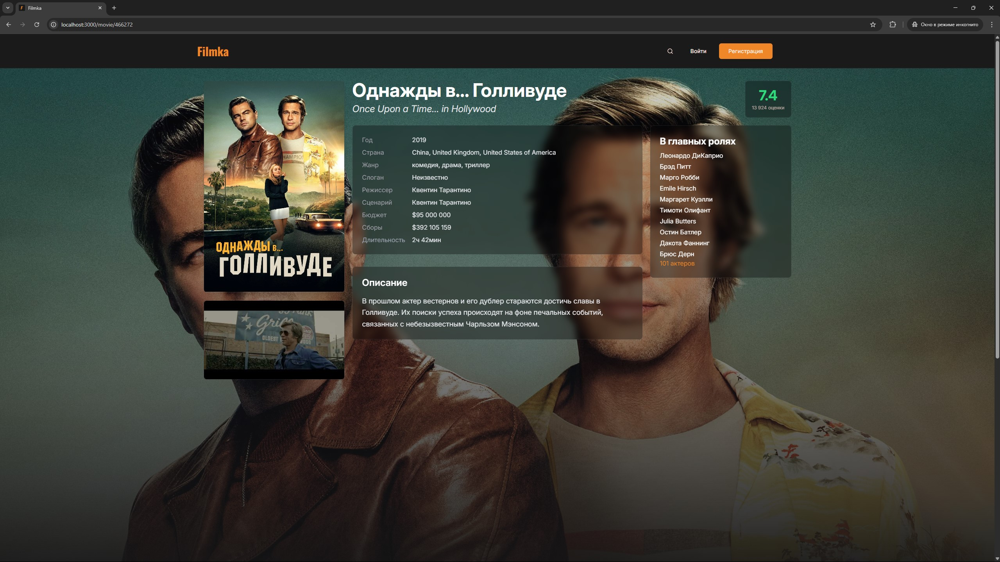
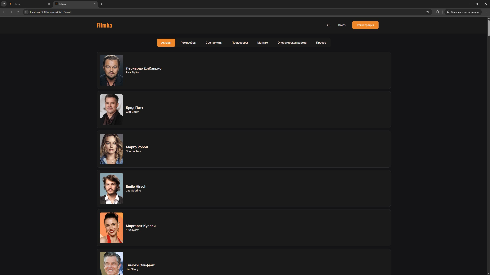

### Добавление в коллекции и оценка

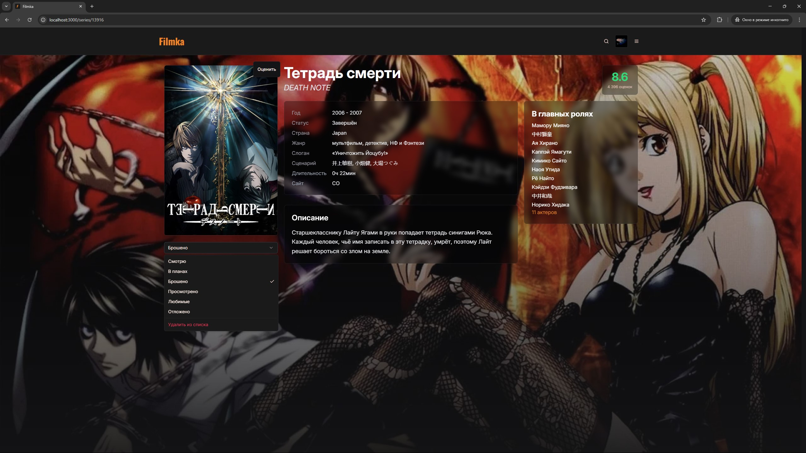
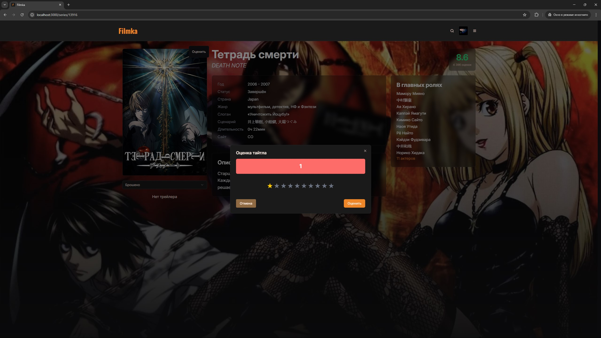

### Страница персоны

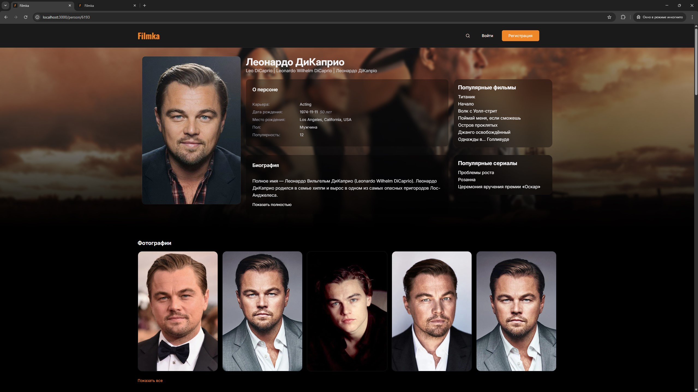
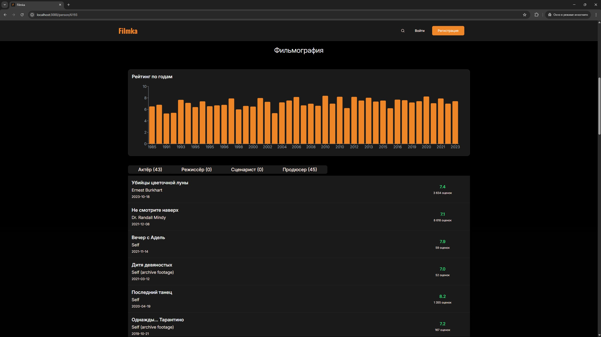

### Каталог

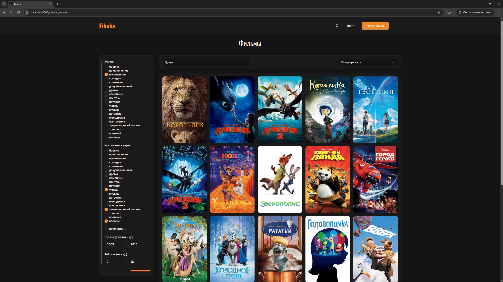

### Профиль пользователя

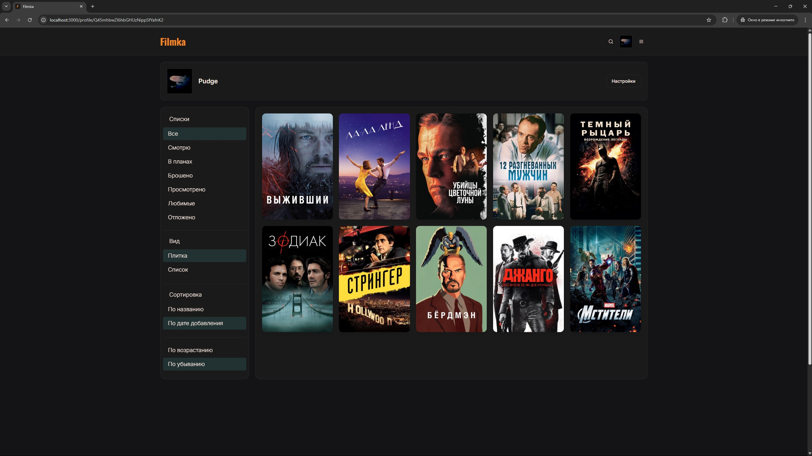
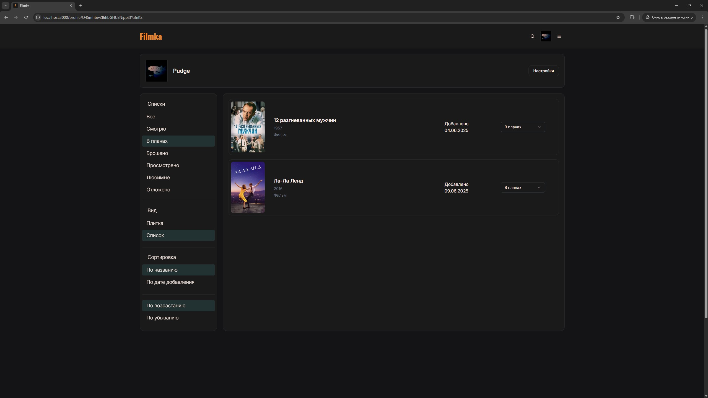

---

## 🚀 Стек технологий

- **React** + **Vite**
- **TypeScript**
- **TailwindCSS** + **shadcn/ui** — стильный UI
- **React Query** — работа с API и кэш
- **Zustand** — стейт менеджер
- **React Hook Form** + **Zod** — формы и валидация
- **Firebase** — аутентификация и база данных
- **TMDB API** — данные о фильмах
- **Rechartso** — графики и статистика

---

## 🧩 Возможности

- Поиск фильмов и сериалов
- Каталог с фильтрацией
- Профиль с папками и пользовательскими рейтингами

---

## ⚠️ Заметки

- Работает только с VPN, так как используется TMDB
- Добавьте в список проксируемых сайтов api.themoviedb.org для общей информации и image.tmdb.org для изображений
- Без адаптации под мобильные устройства

---

## 🤝 Автор

- Filmka разработан как pet-проект для изучения и демонстрации современных технологий фронтенда.
- Контакты: Telegram: https://t.me/Y4k3o | GitHub: https://github.com/Y4k3o

## Лицензия

- This product uses the TMDB API but is not endorsed or certified by TMDB.
